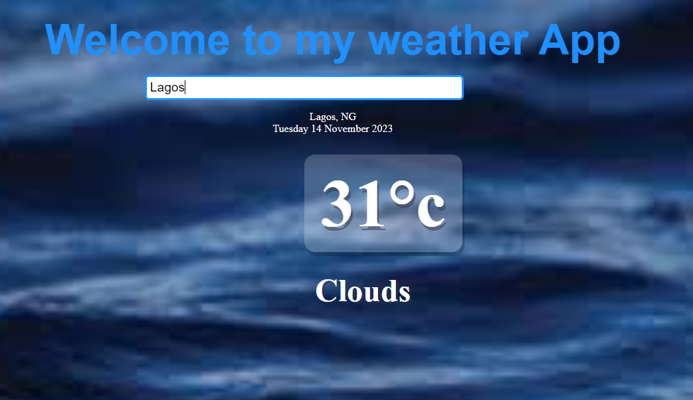

# WeatherApp
Weather App: This Project shows the weather condition of a searched location and the forecast of the next five days.... it visualize the location's windspeed, humidity, pressure and temperature graph.

## Getting Started

Clone or download this repository and run with a local server of open `index.html` with your favorite browser

## Prequisite
- Your browser version must be recent for a better experience.

## Features
- Search Page
- Weather Page
## Tech/framework used
- HTML
- CSS
- ReactJS
- Vite
## Preview
[Preview Here](https://weather-app-nine-beryl-33.vercel.app/)

## Contact

If you want to contact me you can reach me at
-daudyusph05@gmail.com -https://github.com/amuda

## Addtional Info
- This is one of the series of project for the @Codevillage Programming Lessons.
- This is not meant for production. It's for learning purpose only